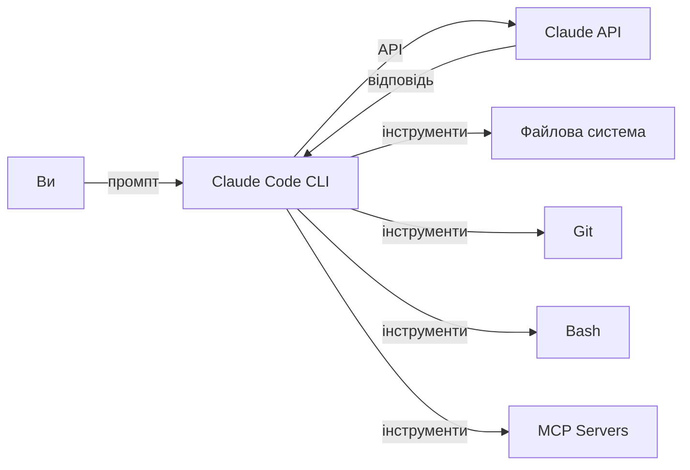
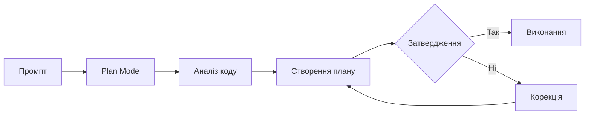
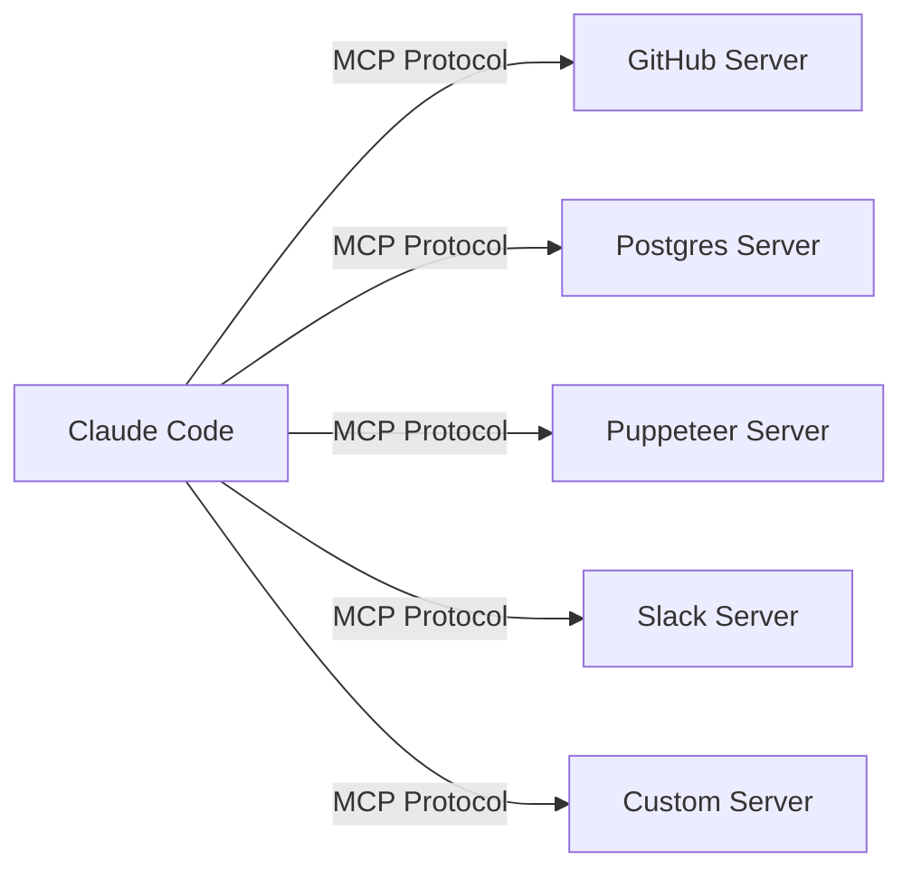
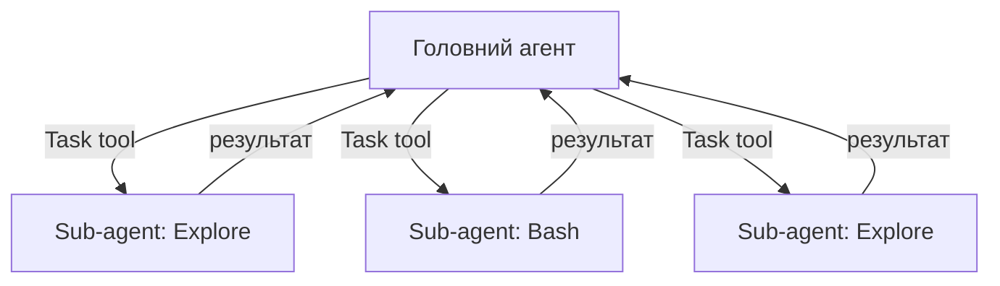
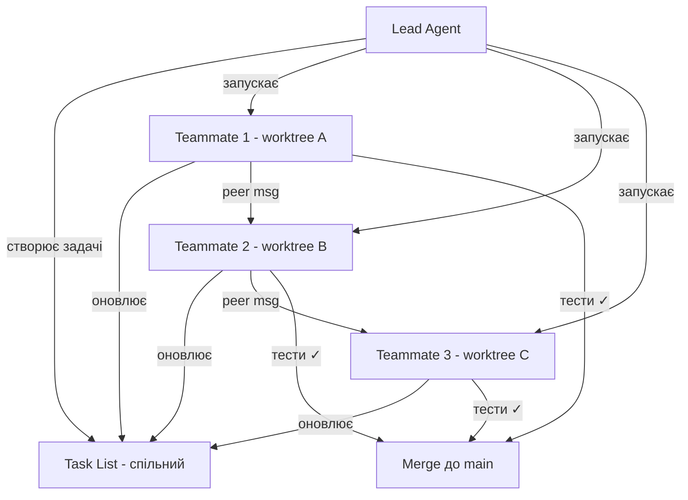

# Claude Code: Практичний воркшоп

Від першої команди до Agent Teams

<div class="pt-12">
  <span class="px-2 py-1 rounded cursor-pointer" hover="bg-white bg-opacity-10">
    Натисніть <kbd>Space</kbd> щоб продовжити
  </span>
</div>

<div class="abs-br m-6 flex gap-2">
  <a href="https://docs.anthropic.com/en/docs/claude-code" target="_blank" class="text-xl slidev-icon-btn opacity-50 !border-none !hover:text-white">
    Docs
  </a>
</div>

<!--
Вітаю всіх на воркшопі з Claude Code! Сьогодні ми пройдемо шлях від встановлення до просунутих функцій, включаючи Agent Teams та Opus 4.6.
-->

---
layout: image-left
image: /vyacheslav-koldovskyy.png
---

# В'ячеслав Колдовський

- Ph.D, доцент
- 20+ років в IT
- SoftServe Academy Competence Manager
- Certified Google Cloud Professional Architect
- Ентузіаст Практичного AI
- Ютубер: [youtube.com/@programmingmentorua](https://www.youtube.com/@programmingmentorua)
- Блогер: [t.me/programmingmentor](https://t.me/programmingmentor)
- Лінкедін: [koldovsky](https://www.linkedin.com/in/koldovsky/)

---

# Передумови

Що потрібно для роботи

<v-clicks>

- **Node.js 18+** — `node -v`
- **Термінал** — bash, zsh, PowerShell, Git Bash
- **API ключ Anthropic** — або авторизація через OAuth
- **4 GB RAM** мінімум
- **Git** — для інтеграцій з Git/GitHub

</v-clicks>

<br>

<div v-click>

```bash
# Перевірка готовності
node -v        # >= 18.0.0
git --version  # >= 2.x
```

</div>

<!--
Перевірте зараз, що у вас все готово. Node.js 18+ обов'язковий. API ключ ми налаштуємо на наступних слайдах.
-->

---
layout: section
---

# Частина 1: Початок

Встановлення, перша сесія, основи роботи

<!--
Починаємо з фундаменту — встановлення та перші кроки з Claude Code.
-->

---

# Що таке Claude Code?

AI-асистент у вашому терміналі

<div class="grid grid-cols-2 gap-8">
<div>

### Можливості

<v-clicks>

- Редагування файлів та коду
- Виконання bash-команд
- Пошук по кодовій базі
- Git-операції
- Робота з MCP серверами
- Паралельні sub-agents

</v-clicks>

</div>
<div>

### Інструменти

<v-clicks>

- `Read` / `Write` / `Edit`
- `Bash` — виконання команд
- `Glob` / `Grep` — пошук
- `Task` — sub-agents
- `WebFetch` / `WebSearch`
- MCP tools — розширення

</v-clicks>

</div>
</div>

<!--
Claude Code — це CLI-інструмент, який працює безпосередньо у вашому терміналі. На відміну від чат-ботів, він може виконувати команди, редагувати файли та працювати з вашим кодом напряму.
-->

---

# Що таке Claude Code? (продовження)

Як це працює



<div class="tip-box mt-4">
<strong>Ключова ідея:</strong> Claude Code працює локально у вашому проєкті — бачить файли, розуміє структуру, виконує команди.
</div>

<!--
Архітектура проста: ви пишете промпт, Claude Code викликає API, отримує відповідь і виконує дії через інструменти — редагування файлів, bash-команди, Git тощо.
-->

---

# Встановлення

Три способи встановити Claude Code

<v-clicks>

**Спосіб 1: Нативний інсталятор (рекомендовано)**
```bash
# macOS / Linux
curl -fsSL https://claude.ai/install.sh | sh
```

**Спосіб 2: Homebrew (macOS)**
```bash
brew install claude-code
```

**Спосіб 3: npm (deprecated)**
```bash
npm install -g @anthropic-ai/claude-code
```

</v-clicks>

<div v-click class="warn-box">
<strong>Увага:</strong> npm-спосіб більше не рекомендується. Використовуйте нативний інсталятор.
</div>

<!--
Нативний інсталятор — найпростіший та рекомендований спосіб. npm ще працює, але вже deprecated.
-->

---

# Перевірка встановлення

Переконайтесь, що все працює

```bash
# Перевірка версії
claude --version

# Діагностика
claude /doctor
```

<v-click>

Очікуваний вивід `/doctor`:

```
✓ Claude Code version: x.x.x
✓ Node.js version: v22.x.x
✓ Authentication: configured
✓ Model access: available
✓ Network: connected
```

</v-click>

<div v-click class="tip-box">
<strong>Порада:</strong> <code>/doctor</code> — перше, що варто запустити при проблемах.
</div>

<!--
Команда /doctor перевіряє всі компоненти: версію, авторизацію, доступ до моделей, мережу. Це ваш перший інструмент діагностики.
-->

---

# Налаштування API ключа

Аутентифікація для роботи з Claude

<v-clicks>

**Варіант 1: Змінна середовища**
```bash
export ANTHROPIC_API_KEY=sk-ant-...
```

**Варіант 2: OAuth (інтерактивна авторизація)**
```bash
claude    # запустіть без ключа — відкриється OAuth flow
```

**Варіант 3: Постійна конфігурація**
```bash
# ~/.claude/settings.json
{
  "apiKey": "sk-ant-..."
}
```

</v-clicks>

<!--
Є три способи авторизації. OAuth — найзручніший для персональних акаунтів. API ключ — для скриптів та CI/CD.
-->

---

# Налаштування API ключа (продовження)

Перевірка та альтернативні провайдери

```bash
# Перевірка авторизації
claude /doctor

# Amazon Bedrock
export CLAUDE_CODE_USE_BEDROCK=1
export AWS_REGION=us-west-2

# Google Vertex AI
export CLAUDE_CODE_USE_VERTEX=1
export CLOUD_ML_REGION=us-east5
```

<div class="tip-box">
<strong>Порада:</strong> Для корпоративного використання — Bedrock або Vertex AI для compliance та приватності.
</div>

<!--
Окрім прямого API Anthropic, Claude Code підтримує Amazon Bedrock та Google Vertex AI. Це важливо для корпоративних клієнтів.
-->

---

# Перша сесія

Запускаємо Claude Code

```bash
# Інтерактивний режим
claude

# Одноразова команда
claude "Поясни структуру цього проєкту"

# Продовжити останню сесію
claude -c

# Продовжити конкретну сесію
claude --resume SESSION_ID
```

<v-click>

```
$ claude
╭──────────────────────────────────────╮
│  Claude Code  v1.x.x                │
│  Model: claude-opus-4-6             │
│  Context: 1,000,000 tokens          │
╰──────────────────────────────────────╯
>
```

</v-click>

<!--
claude без аргументів — інтерактивний режим. claude з рядком у лапках — одноразова команда. -c — продовжити сесію.
-->

---
layout: center
---

# Вправа 1

<span class="exercise-badge">Практика</span>

### Перша сесія Claude Code

```bash
# 1. Запустіть Claude Code
claude

# 2. Запитайте про поточну директорію
> Що знаходиться в поточній директорії?

# 3. Попросіть створити файл
> Створи файл hello.txt з текстом "Hello from Claude Code"

# 4. Вийдіть
> /exit
```

<div class="tip-box">
<strong>Час:</strong> 5 хвилин
</div>

<!--
Перша практична вправа. Запустіть Claude Code, поставте просте запитання, створіть файл. Зверніть увагу на те, як Claude запитує дозволи.
-->

---

# Базова взаємодія

Корисні прийоми у сесії

<v-clicks>

- **`@file.ts`** — додати файл до контексту
- **`@folder/`** — додати всю папку
- **`@url`** — завантажити вміст URL

</v-clicks>

<v-click>

### Клавіатурні скорочення

| Комбінація | Дія |
|---|---|
| <kbd>Tab</kbd> | Прийняти автодоповнення |
| <kbd>Esc</kbd> <kbd>Esc</kbd> | Перервати генерацію |
| <kbd>Ctrl+A</kbd> / <kbd>Ctrl+E</kbd> | Початок / кінець рядка |
| <kbd>Ctrl+W</kbd> | Видалити слово |
| <kbd>Ctrl+L</kbd> | Очистити екран |

</v-click>

<!--
Символ @ — потужний інструмент для додавання контексту. Можна вказувати файли, папки та навіть URL. Клавіатурні скорочення стандартні для терміналу.
-->

---

# Базова взаємодія (продовження)

Мультирядковий ввід та інші прийоми

```bash
# Мультирядковий ввід — Shift+Enter або \
> Створи функцію, яка: \
  1. Приймає масив чисел \
  2. Фільтрує парні \
  3. Повертає їх суму

# Передати файл через stdin
cat error.log | claude "Проаналізуй цей лог"

# Передати зображення
claude "Що на цьому скріншоті?" --image screenshot.png
```

<div class="tip-box">
<strong>Порада:</strong> Claude Code розуміє зображення — скріншоти UI, діаграми, помилки в браузері.
</div>

<!--
Мультирядковий ввід корисний для складних запитів. Через pipe можна передавати логи, а через --image — скріншоти.
-->

---

# Slash-команди

Вбудовані команди для керування сесією

| Команда | Дія |
|---|---|
| `/help` | Показати довідку |
| `/clear` | Очистити контекст |
| `/compact` | Стиснути контекст |
| `/context` | Показати використання токенів |
| `/model` | Змінити модель |
| `/exit` | Вийти з сесії |

<!--
Slash-команди починаються з /. Це вбудовані команди для керування сесією, а не промпти для моделі.
-->

---

# Slash-команди (продовження)

Команди для сесій та моделей

| Команда | Дія |
|---|---|
| `/init` | Створити CLAUDE.md |
| `/commit` | Створити Git commit |
| `/pr` | Створити Pull Request |
| `/plan` | Режим планування |
| `/vim` | Увімкнути vim-режим |
| `/doctor` | Діагностика |
| `/config` | Відкрити налаштування |

<div class="tip-box">
<strong>Порада:</strong> Введіть <code>/</code> та натисніть <kbd>Tab</kbd> для автодоповнення списку команд.
</div>

<!--
Є команди для Git-операцій, планування, діагностики. /init — одна з найважливіших, створює CLAUDE.md для вашого проєкту.
-->

---
layout: center
---

# Вправа 2

<span class="exercise-badge">Практика</span>

### Slash-команди

```bash
claude

# 1. Перегляньте довідку
> /help

# 2. Перевірте контекст
> /context

# 3. Змініть модель
> /model haiku

# 4. Поверніть модель назад
> /model opus

# 5. Стисніть контекст
> /compact
```

<div class="tip-box">
<strong>Час:</strong> 3 хвилини
</div>

<!--
Спробуйте різні slash-команди. Зверніть увагу, як /context показує витрачені токени та /model дозволяє переключатись між моделями.
-->

---
layout: section
---

# Частина 2: Просунутий рівень

CLAUDE.md, конфігурація, дозволи, контекст, Git

<!--
Переходимо до глибших концепцій — як налаштувати Claude Code під ваш проєкт.
-->

---

# CLAUDE.md — Пам'ять проєкту

Файл інструкцій для Claude Code

<v-clicks>

- **Що це?** — Markdown-файл з інструкціями для Claude Code
- **Де розміщувати?** — Корінь проєкту, або `~/.claude/CLAUDE.md` (глобальний)
- **Навіщо?** — Стиль коду, архітектура, команди для збірки/тестів, обмеження

</v-clicks>

<v-click>

```markdown
# CLAUDE.md

## Проєкт
TypeScript + React + Vite додаток для управління задачами.

## Команди
- `npm run dev` — запуск dev-сервера
- `npm test` — запуск тестів
- `npm run lint` — перевірка коду

## Стиль коду
- Використовуй функціональні компоненти React
- Іменування файлів: kebab-case
- Коментарі англійською
```

</v-click>

<!--
CLAUDE.md — найважливіший файл для ефективної роботи з Claude Code. Він задає контекст вашого проєкту: стек, команди, правила.
-->

---

# CLAUDE.md — Що включати

Рекомендований вміст

<div class="grid grid-cols-2 gap-6">
<div>

### Обов'язково

<v-clicks>

- Короткий опис проєкту
- Команди build / test / lint
- Стек технологій
- Структура директорій
- Стиль коду

</v-clicks>

</div>
<div>

### Бажано

<v-clicks>

- Архітектурні рішення
- Обмеження та заборони
- Приклади хороших патернів
- Посилання на документацію
- Особливості CI/CD

</v-clicks>

</div>
</div>

<div v-click class="warn-box">
<strong>Не додавайте:</strong> секрети, API ключі, паролі, великі дампи коду.
</div>

<!--
CLAUDE.md повинен бути стислим, але інформативним. Не перевантажуйте його — Claude Code прочитає його на початку кожної сесії.
-->

---
layout: center
---

# Вправа 3

<span class="exercise-badge">Практика</span>

### Створення CLAUDE.md

```bash
claude

# Спосіб 1: Автоматичне створення
> /init

# Спосіб 2: Ручне створення
> Створи CLAUDE.md для Node.js проєкту з Express та PostgreSQL.
> Включи команди для запуску, тестування та лінтингу.
```

<div class="tip-box">
<strong>Час:</strong> 5 хвилин. Після створення перегляньте файл та відредагуйте під свій проєкт.
</div>

<!--
/init — найшвидший спосіб. Claude Code проаналізує ваш проєкт і створить CLAUDE.md автоматично.
-->

---

# Конфігурація

Ієрархія налаштувань settings.json

```
~/.claude/settings.json           ← Глобальні (користувач)
  └── .claude/settings.json       ← Проєкт (спільні, в Git)
       └── .claude/settings.local.json  ← Локальні (не в Git)
```

<v-click>

```json
// ~/.claude/settings.json
{
  "permissions": {
    "allow": ["Read", "Glob", "Grep"],
    "deny": ["Bash(rm -rf *)"]
  },
  "env": {
    "CLAUDE_CODE_MAX_THINKING_TOKENS": "50000"
  },
  "model": "claude-opus-4-6"
}
```

</v-click>

<div v-click class="tip-box">
<strong>Пріоритет:</strong> Локальні > Проєктні > Глобальні. Більш специфічні налаштування перекривають загальні.
</div>

<!--
Три рівні конфігурації дозволяють налаштувати Claude Code для різних контекстів: глобально, для проєкту, та локально для розробника.
-->

---

# Конфігурація (продовження)

Корисні змінні середовища

| Змінна | Опис |
|---|---|
| `ANTHROPIC_API_KEY` | API ключ |
| `CLAUDE_CODE_MAX_THINKING_TOKENS` | Ліміт токенів мислення |
| `CLAUDE_CODE_USE_BEDROCK` | Використовувати Bedrock |
| `CLAUDE_CODE_USE_VERTEX` | Використовувати Vertex AI |
| `CLAUDE_MODEL` | Модель за замовчуванням |
| `CLAUDE_CODE_EXPERIMENTAL_AGENT_TEAMS` | Увімкнути Agent Teams |

<!--
Змінні середовища — ще один спосіб конфігурації. Вони мають найвищий пріоритет.
-->

---

# Режими дозволів

Контроль того, що Claude Code може робити

<v-clicks>

| Режим | Опис |
|---|---|
| **default** | Запитує дозвіл на кожну дію |
| **plan** | Тільки читання, без змін |
| **acceptEdits** | Автоматично дозволяє редагування файлів |
| **bypass** | Дозволяє все (обережно!) |

</v-clicks>

<v-click>

```bash
# Запуск у режимі plan
claude --mode plan

# Або через слеш-команду
> /plan
```

</v-click>

<!--
Режими дозволів — важлива функція безпеки. Починайте з default, переходьте на acceptEdits коли довірите Claude Code.
-->

---

# Дозволи на рівні інструментів

Гранулярний контроль

```json
// .claude/settings.json
{
  "permissions": {
    "allow": [
      "Read",
      "Write",
      "Edit",
      "Glob",
      "Grep",
      "Bash(npm test)",
      "Bash(npm run lint)",
      "Bash(git *)"
    ],
    "deny": [
      "Bash(rm -rf *)",
      "Bash(curl * | bash)",
      "Bash(chmod 777 *)"
    ]
  }
}
```

<div class="tip-box">
<strong>Порада:</strong> Дозволяйте конкретні bash-команди через glob-патерни замість загального <code>Bash</code>.
</div>

<!--
Дозволи можна налаштувати для кожного інструменту. Глоб-патерни дозволяють гнучко контролювати, які bash-команди дозволені.
-->

---
layout: center
---

# Вправа 4

<span class="exercise-badge">Практика</span>

### Налаштування дозволів

```bash
# 1. Запустіть у режимі plan (тільки читання)
claude --mode plan
> Проаналізуй структуру проєкту та запропонуй покращення
> /exit

# 2. Запустіть у звичайному режимі
claude
> Створи файл test.js з простим тестом
# Зверніть увагу на запит дозволу
```

<div class="tip-box">
<strong>Час:</strong> 3 хвилини
</div>

<!--
Спробуйте режим plan — Claude Code зможе тільки читати файли, без змін. Потім порівняйте зі звичайним режимом.
-->

---

# Plan Mode

Спочатку план, потім виконання

```bash
# Увімкнути режим планування
> /plan

# Claude Code створить план, не виконуючи дій
> Рефакторни модуль авторизації: виділи JWT логіку в окремий сервіс

# Після перегляду плану — дозвольте виконання
> Виглядає добре, виконуй план
```

<v-click>



</v-click>

<!--
Plan Mode — потужний патерн для складних змін. Спочатку Claude Code створює план, ви його переглядаєте, і лише потім він виконує зміни.
-->

---

# Управління контекстом

Токени — ваш найцінніший ресурс

<v-clicks>

- **Opus 4.6** — до 1M токенів контексту (beta)
- **Sonnet 4.5** — 200K токенів контексту
- Контекст = ваші промпти + відповіді + файли + результати інструментів

</v-clicks>

<v-click>

```bash
# Перевірити використання контексту
> /context

# Стиснути контекст (зберігає суть, зменшує розмір)
> /compact

# Повністю очистити контекст
> /clear
```

</v-click>

<!--
Контекст — це обмежений ресурс. Стежте за ним через /context. Коли він наближається до ліміту, використовуйте /compact.
-->

---

# Управління контекстом (продовження)

Стратегії ефективного використання контексту

<div class="grid grid-cols-2 gap-6">
<div>

### Добре

<v-clicks>

- Стислі, конкретні промпти
- `@file.ts` замість "відкрий файл"
- `/compact` коли контекст зростає
- Нова сесія для нової задачі
- Вказуйте конкретні рядки

</v-clicks>

</div>
<div>

### Погано

<v-clicks>

- "Подивись весь проєкт"
- Копіювати великі файли в промпт
- Одна сесія на весь день
- Розмиті запити без контексту
- Не стежити за /context

</v-clicks>

</div>
</div>

<!--
Ефективне управління контекстом — ключ до продуктивної роботи. Конкретність промптів безпосередньо впливає на якість відповідей.
-->

---

# Управління контекстом — Best Practices

Практичні рекомендації

<v-clicks>

1. **Починайте з /context** — знайте, скільки токенів витрачено
2. **Використовуйте /compact з підказкою** — `> /compact Зосередься на модулі auth`
3. **Нова задача = нова сесія** — `/clear` або новий `claude`
4. **Передавайте файли через @** — ефективніше за копіювання
5. **Продовжуйте сесії** — `claude -c` замість повторення контексту

</v-clicks>

<div v-click class="tip-box">
<strong>Правило:</strong> Якщо <code>/context</code> показує > 70% використання — час для <code>/compact</code> або нової сесії.
</div>

<!--
Золоте правило: стежте за контекстом і діяте проактивно. Не чекайте, поки він закінчиться.
-->

---

# Робота з файлами

Інструменти Claude Code для файлових операцій

| Інструмент | Опис | Приклад |
|---|---|---|
| `Read` | Читання файлу | Прочитати `src/index.ts` |
| `Write` | Створення файлу | Створити новий файл |
| `Edit` | Редагування частини файлу | Змінити функцію |
| `Glob` | Пошук файлів за патерном | `**/*.test.ts` |
| `Grep` | Пошук тексту у файлах | Знайти `TODO` |
| `Bash` | Системні команди | `npm test` |

<!--
Claude Code має набір спеціалізованих інструментів для роботи з файлами. Кожен оптимізований для своєї задачі.
-->

---

# Робота з файлами (продовження)

Ефективні патерни використання

```bash
# Конкретне посилання на файл
> Виправ баг у @src/auth/jwt.service.ts рядок 45

# Пошук по проєкту
> Знайди всі місця, де використовується deprecated API

# Масове редагування
> Заміни всі console.log на logger.info у папці src/

# Створення з контекстом
> Створи unit тест для @src/utils/validators.ts
```

<div class="tip-box">
<strong>Порада:</strong> Чим конкретніше ви вказуєте файл і місце — тим точніше результат.
</div>

<!--
Конкретність — ключ до якості. Вказуйте конкретні файли, рядки, функції. Claude Code працює краще з точним контекстом.
-->

---
layout: center
---

# Вправа 5

<span class="exercise-badge">Практика</span>

### Робота з файлами

```bash
claude

# 1. Створіть простий JS-проєкт
> Створи файл calculator.js з функціями add, subtract, multiply, divide

# 2. Додайте тест
> Створи тест calculator.test.js для всіх функцій з @calculator.js

# 3. Знайдіть помилку
> Функція divide не обробляє ділення на нуль. Виправ @calculator.js
```

<div class="tip-box">
<strong>Час:</strong> 5 хвилин
</div>

<!--
Створіть простий проєкт, додайте тести, виправте баг. Зверніть увагу, як Claude Code працює з посиланням @.
-->

---

# Git-інтеграція

Вбудована робота з Git

```bash
# Створити commit з осмисленим повідомленням
> /commit

# Створити Pull Request
> /pr

# Push до remote
> /push
```

<v-click>

```bash
# Інтелектуальне вирішення конфліктів
> Виріши merge конфлікти в @src/app.ts

# Аналіз змін
> Що змінилось з останнього коміту?

# Код-рев'ю
> Зроби код-рев'ю для всіх staged змін
```

</v-click>

<!--
Git-інтеграція — одна з найпотужніших функцій Claude Code. Він генерує осмислені commit messages, створює PR з описом змін.
-->

---

# Git-інтеграція (продовження)

Як Claude Code працює з Git

<v-clicks>

1. **`/commit`** — аналізує staged зміни → генерує commit message → створює commit
2. **`/pr`** — аналізує всі коміти від base branch → створює PR з описом
3. **Merge conflicts** — розуміє обидві сторони конфлікту → пропонує рішення
4. **Blame & history** — може проаналізувати хто і чому змінив код

</v-clicks>

<div v-click class="tip-box">
<strong>Порада:</strong> Додайте формат commit messages у CLAUDE.md — Claude Code буде його дотримуватись.
</div>

<!--
Додайте конвенцію комітів (наприклад, Conventional Commits) у CLAUDE.md, і Claude Code буде автоматично генерувати повідомлення у цьому форматі.
-->

---
layout: center
---

# Вправа 6

<span class="exercise-badge">Практика</span>

### Git-інтеграція

```bash
# 1. Ініціалізуйте Git-репозиторій
git init && git add -A && git commit -m "Initial commit"

# 2. Зробіть зміни через Claude Code
claude
> Додай обробку помилок у @calculator.js

# 3. Створіть commit
> /commit

# 4. Перегляньте результат
> /exit
git log --oneline
```

<div class="tip-box">
<strong>Час:</strong> 5 хвилин
</div>

<!--
Створіть коміт через /commit і порівняйте якість повідомлення з тим, що ви зазвичай пишете вручну.
-->

---

# IDE-інтеграції

Claude Code у вашому улюбленому редакторі

<v-clicks>

**VS Code**
```bash
# Встановіть розширення
code --install-extension anthropic.claude-code
# Або: Ctrl+Shift+P → "Install Claude Code"
```

**JetBrains (IntelliJ, WebStorm, PyCharm)**
```bash
# Через Marketplace
Settings → Plugins → "Claude Code"
```

**Vim-режим у терміналі**
```bash
> /vim   # Увімкнути vim-навігацію в CLI
```

</v-clicks>

<!--
Claude Code інтегрується з популярними IDE. У VS Code і JetBrains є окремі розширення з UI. Також є vim-режим для терміналу.
-->

---

# Вибір моделі

Opus 4.6 vs Sonnet 4.5 vs Haiku 4.5

| Параметр | Opus 4.6 | Sonnet 4.5 | Haiku 4.5 |
|---|---|---|---|
| Контекст | 1M (beta) | 200K | 200K |
| Вивід | 128K | 64K | 64K |
| Швидкість | Повільніше | Швидко | Найшвидше |
| Ціна (вхід) | $5/M | $3/M | $0.80/M |
| Ціна (вивід) | $25/M | $15/M | $4/M |
| Найкраще для | Складні задачі | Щоденна робота | Прості задачі |

<!--
Три моделі для різних задач. Opus 4.6 — найпотужніша, для складних рефакторингів. Sonnet — щоденний вибір. Haiku — для швидких простих задач.
-->

---

# Вибір моделі (продовження)

Як і коли переключатись

```bash
# У сесії
> /model sonnet   # Перемкнути на Sonnet 4.5
> /model opus     # Перемкнути на Opus 4.6
> /model haiku    # Перемкнути на Haiku 4.5

# При запуску
claude --model claude-sonnet-4-5-20250929

# В конфігурації
# ~/.claude/settings.json
{
  "model": "claude-opus-4-6"
}
```

<div class="tip-box">
<strong>Стратегія:</strong> Починайте з Sonnet для розвідки, переходьте на Opus для складних задач, Haiku — для рутини.
</div>

<!--
Гнучке переключення між моделями — ключ до оптимізації витрат. Не потрібно Opus для простого TODO-коментаря.
-->

---
layout: section
---

# Частина 3: Експертний рівень

Opus 4.6, MCP, hooks, Agent Teams, CI/CD

<!--
Переходимо до найцікавішого — нові функції Claude Code: Opus 4.6, Agent Teams, MCP Tool Search.
-->

---

# Opus 4.6 — Огляд

Найпотужніша модель Claude (лютий 2026)

<v-clicks>

- **1M токенів контексту** (beta) — обробка цілих великих кодових баз
- **128K токенів виводу** — вдвічі більше за попередню версію
- **Adaptive reasoning** — динамічно регулює глибину мислення
- **Effort levels** — low, medium, high (default), max

</v-clicks>

<v-click>

### Бенчмарки

| Бенчмарк | Opus 4.6 | Opus 4.5 |
|---|---|---|
| SWE-bench | **80.8%** | 72.0% |
| Terminal-Bench | **65.4%** | 43.2% |
| ARC AGI | **68.8%** | 34.4% |

</v-click>

<div v-click class="tip-box">
<strong>Ціна:</strong> $5/M вхід, $25/M вивід — така ж як Opus 4.5
</div>

<!--
Opus 4.6 — значний крок вперед. Подвоєний контекст, подвоєний вивід, і вдвічі кращі бенчмарки на ARC AGI. При тій самій ціні.
-->

---

# Adaptive Reasoning

Розумне мислення — менше витрат, краща якість

<v-clicks>

**Рівні зусиль (effort levels):**

| Рівень | Коли використовувати | Мислення |
|---|---|---|
| `low` | Прості запити, пошук файлів | Мінімальне |
| `medium` | Стандартні задачі | Помірне |
| `high` | Складне кодування (за замовчуванням) | Глибоке |
| `max` | Найскладніші проблеми, архітектура | Максимальне |

</v-clicks>

<v-click>

```bash
# Встановити рівень зусиль
export CLAUDE_CODE_BUDGET_TOKENS=max  # або high, medium, low

# Або через API
{
  "model": "claude-opus-4-6",
  "budget_tokens": 50000
}
```

</v-click>

<!--
Adaptive reasoning — ключова інновація Opus 4.6. Модель сама визначає, скільки "думати", але ви можете вказати рівень зусиль.
-->

---

# Opus 4.6 на практиці

Використання в Claude Code

```bash
# Увімкнути extended thinking (Tab під час генерації)
# Verbose mode — бачити процес мислення
# Ctrl+O — toggle verbose output

# Налаштування максимального мислення
export CLAUDE_CODE_MAX_THINKING_TOKENS=100000
```

<v-click>

### Коли використовувати Opus 4.6

<div class="grid grid-cols-2 gap-4">
<div>

**Opus 4.6 (складне)**
- Рефакторинг архітектури
- Дебаг складних багів
- Генерація з нуля
- Code review критичного коду

</div>
<div>

**Sonnet 4.5 (щоденне)**
- Додати функцію
- Написати тест
- Виправити простий баг
- Генерація документації

</div>
</div>

</v-click>

<!--
Tab під час генерації показує процес мислення Claude. Ctrl+O — verbose mode для детальнішого виводу. Використовуйте Opus для складного, Sonnet для рутини.
-->

---

# MCP — Model Context Protocol

Відкритий протокол для розширення можливостей Claude

<v-clicks>

- **Що?** — Стандартний протокол для підключення зовнішніх інструментів
- **Claude Code** — виступає як MCP client
- **MCP Servers** — надають інструменти (tools) та ресурси (resources)
- **Аналогія** — USB для AI: один стандарт, багато пристроїв

</v-clicks>

<v-click>



</v-click>

<!--
MCP — відкритий протокол від Anthropic. Він дозволяє підключати до Claude Code будь-які зовнішні інструменти через стандартизований інтерфейс.
-->

---

# Додавання MCP серверів

Конфігурація та підключення

```bash
# Додати MCP сервер (scope: user або project)
claude mcp add puppeteer --scope user -- npx -y @anthropic-ai/mcp-puppeteer

# Додати з аргументами
claude mcp add postgres --scope project -- \
  npx -y @anthropic-ai/mcp-postgres postgresql://localhost/mydb

# Переглянути підключені сервери
claude mcp list

# Видалити сервер
claude mcp remove puppeteer
```

<v-click>

```json
// .claude/settings.json
{
  "mcpServers": {
    "github": {
      "command": "npx",
      "args": ["-y", "@anthropic-ai/mcp-github"],
      "env": { "GITHUB_TOKEN": "ghp_..." }
    }
  }
}
```

</v-click>

<!--
claude mcp add — основна команда для підключення серверів. scope визначає, чи це глобальне чи проєктне налаштування.
-->

---

# Популярні MCP сервери

Розширення для різних потреб

<div class="grid grid-cols-2 gap-6">
<div>

### Браузер та UI
- **puppeteer** — автоматизація браузера
- **playwright** — E2E тестування
- **fetch** — HTTP запити

### Бази даних
- **postgres** — PostgreSQL запити
- **sqlite** — SQLite операції

</div>
<div>

### Інтеграції
- **github** — GitHub API
- **slack** — Slack повідомлення
- **linear** — Linear тікети
- **sentry** — Sentry помилки

### Утиліти
- **filesystem** — розширена робота з файлами
- **memory** — персистентна пам'ять

</div>
</div>

<!--
Екосистема MCP серверів швидко зростає. Від браузерної автоматизації до інтеграцій з project management інструментами.
-->

---

# MCP Tool Search

95% економії контексту

<v-clicks>

- **Проблема:** Кожен MCP сервер додає опис усіх інструментів у контекст (~77K токенів)
- **Рішення:** MCP Tool Search завантажує інструменти динамічно, за потребою
- **Результат:** ~8.7K замість ~77K токенів — **95% економії**
- **Статус:** Увімкнено за замовчуванням для всіх користувачів

</v-clicks>

<v-click>

```bash
# Tool Search працює автоматично
# Claude Code шукає потрібний інструмент за описом задачі

# Приклад: замість завантаження всіх 50+ інструментів GitHub MCP,
# завантажується лише "create_pull_request" коли потрібно створити PR
```

</v-click>

<div v-click class="tip-box">
<strong>Переваги:</strong> Більше MCP серверів підключено = більша економія від Tool Search.
</div>

<!--
MCP Tool Search — критично важлива оптимізація. Без неї кожен MCP сервер з'їдає тисячі токенів контексту. Тепер інструменти завантажуються лише коли потрібні.
-->

---

# Hooks

Автоматизація подій у Claude Code

<v-clicks>

**Типи подій:**

| Подія | Коли спрацьовує |
|---|---|
| `PreToolUse` | Перед виконанням інструменту |
| `PostToolUse` | Після виконання інструменту |
| `UserPromptSubmit` | При відправці промпту |

**Типи хуків:**

| Тип | Опис |
|---|---|
| `command` | Виконує shell-команду |
| `prompt` | Додає інструкції для Claude |

</v-clicks>

<!--
Hooks — спосіб автоматизувати дії при певних подіях. Наприклад, автоформатування після кожного редагування файлу.
-->

---

# Конфігурація Hooks

Практичні приклади

```json
// .claude/settings.json
{
  "hooks": {
    "PostToolUse": [
      {
        "matcher": "Write|Edit",
        "command": "npx prettier --write $CLAUDE_FILE_PATH",
        "type": "command"
      }
    ],
    "PreToolUse": [
      {
        "matcher": "Bash",
        "command": "echo 'Running: $CLAUDE_TOOL_INPUT'",
        "type": "command"
      }
    ],
    "UserPromptSubmit": [
      {
        "matcher": "",
        "type": "prompt",
        "prompt": "Завжди використовуй TypeScript strict mode"
      }
    ]
  }
}
```

<!--
Hooks конфігуруються в settings.json. matcher — регулярний вираз для фільтрації. command — shell-команда для виконання.
-->

---

# Hooks — Сценарії використання

Практичні приклади автоматизації

<v-clicks>

**1. Авто-форматування** — Prettier після кожного збереження

**2. Авто-лінтинг** — ESLint перевірка після редагування

**3. Безпека** — Блокування небезпечних команд

**4. Аудит** — Логування всіх дій у файл

</v-clicks>

<v-click>

```json
{
  "hooks": {
    "PreToolUse": [
      {
        "matcher": "Bash",
        "command": "echo \"$(date): $CLAUDE_TOOL_INPUT\" >> ~/.claude/audit.log",
        "type": "command"
      }
    ]
  }
}
```

</v-click>

<!--
Hooks дозволяють побудувати автоматизований workflow: форматування, лінтинг, безпека, аудит — все працює автоматично.
-->

---

# Custom Slash Commands

Створення власних команд

<v-clicks>

- Розміщуються в `.claude/commands/`
- Формат: Markdown з промптом
- `$ARGUMENTS` — підставляє аргументи користувача
- Frontmatter для метаданих

</v-clicks>

<v-click>

```markdown
<!-- .claude/commands/review.md -->
---
description: Код-рев'ю поточних змін
---

Проведи ретельне код-рев'ю для всіх змін у поточному бранчі.

Перевір:
1. Логічні помилки
2. Безпеку (OWASP top 10)
3. Продуктивність
4. Тестове покриття

$ARGUMENTS
```

</v-click>

```bash
# Використання
> /project:review Зверни увагу на SQL-ін'єкції
```

<!--
Custom slash commands — простий спосіб створити повторювані промпти. Markdown файл у .claude/commands/ стає доступним як /project:назва.
-->

---

# Custom Skills

Доменні навички для Claude Code

````markdown
<!-- .claude/skills/SKILL.md -->
---
name: react-component
description: Створення React компонентів за стандартами проєкту
---

# React Component Skill

При створенні React компонентів:
1. Використовуй функціональні компоненти з TypeScript
2. Props інтерфейс окремо від компонента
3. Стилі через CSS Modules
4. Тести через React Testing Library
5. Storybook stories для кожного компонента
````

<!--
Skills — це розширені промпти з доменним контекстом. Вони дозволяють Claude Code працювати за стандартами вашого проєкту.
-->

---

# Plugin System

Пакети розширень для Claude Code

<v-clicks>

- **Що?** — Бандли з commands + agents + MCP servers + hooks
- **Навіщо?** — Одна команда встановлення, повний workflow
- **Як?** — `claude plugin install <name>`

</v-clicks>

<v-click>

```bash
# Встановити плагін
claude plugin install @example/react-toolkit

# Що входить у плагін:
# ├── commands/       → Slash-команди
# ├── skills/         → Навички
# ├── hooks/          → Автоматизація
# └── mcp-servers/    → MCP інструменти

# Переглянути встановлені
claude plugin list
```

</v-click>

<div v-click class="tip-box">
<strong>Ідея:</strong> Створіть плагін для вашої команди — стандартизуйте workflow всіх розробників.
</div>

<!--
Plugin System об'єднує всі механізми розширення в один пакет. Встановіть один плагін — отримайте commands, skills, hooks, MCP конфігурацію.
-->

---
layout: center
---

# Вправа 7

<span class="exercise-badge">Практика</span>

### Створення Custom Command

```bash
# 1. Створіть директорію для команд
mkdir -p .claude/commands

# 2. Створіть команду через Claude Code
claude
> Створи файл .claude/commands/explain.md з промптом:
> "Поясни код у файлі $ARGUMENTS простою мовою,
> з прикладами використання та можливими edge cases"

# 3. Використайте команду
> /project:explain src/calculator.js
```

<div class="tip-box">
<strong>Час:</strong> 5 хвилин
</div>

<!--
Створіть свою першу custom command. Зверніть увагу, як $ARGUMENTS підставляється автоматично.
-->

---

# Sub-Agents

Паралельна робота з ізольованим контекстом

<v-clicks>

- **Що?** — Окремі екземпляри Claude з власним контекстом
- **Навіщо?** — Паралельні задачі без забруднення основного контексту
- **Обмеження** — Один рівень вкладеності (sub-agent не може створити sub-agent)

</v-clicks>

<v-click>

### Типи sub-agents

| Тип | Призначення | Інструменти |
|---|---|---|
| `Explore` | Дослідження коду | Read, Glob, Grep |
| `Plan` | Планування реалізації | Read, Glob, Grep |
| `Bash` | Виконання команд | Bash |
| `general-purpose` | Універсальний | Всі |

</v-click>

<!--
Sub-agents — механізм паралельної роботи. Кожен sub-agent працює в ізольованому контексті і повертає результат батьківському процесу.
-->

---

# Sub-Agents — Workflow

Як працюють паралельні агенти



<v-click>

```bash
# Claude Code автоматично створює sub-agents коли потрібно
> Проаналізуй архітектуру проєкту: перевір структуру, залежності та тести

# Claude Code може запустити 3 sub-agents паралельно:
# 1. Explore — аналіз структури
# 2. Explore — аналіз залежностей
# 3. Bash — запуск тестів
```

</v-click>

<!--
Sub-agents запускаються автоматично, коли Claude Code бачить можливість паралелізації. Кожен працює незалежно і повертає результат.
-->

---

# Sub-Agents vs Agent Teams

Порівняння двох підходів

| Параметр | Sub-Agents | Agent Teams |
|---|---|---|
| **Комунікація** | Тільки з батьком | Peer-to-peer |
| **Координація** | Батьківський агент | Lead agent + спільні задачі |
| **Файлова система** | Спільна | Окремі git worktrees |
| **Рівні вкладеності** | 1 рівень | 1 рівень |
| **Злиття коду** | Немає | Merge коли тести пройшли |
| **Витрата токенів** | Помірна | ~Nx (N = кількість) |
| **Статус** | Стабільний | Експериментальний |

<div class="tip-box">
<strong>Правило:</strong> Sub-agents для дослідження та простих задач. Agent Teams для паралельної розробки.
</div>

<!--
Sub-agents — легковісні та швидкі для паралельного дослідження. Agent Teams — повноцінні паралельні розробники з координацією.
-->

---

# Agent Teams (Swarms)

Команда AI-агентів, що працюють разом

<v-clicks>

- **Lead agent** — координує роботу, розподіляє задачі
- **Teammates** — працюють паралельно над своїми задачами
- **Peer-to-peer** — агенти спілкуються між собою
- **Git worktrees** — кожен працює в окремій копії коду
- **Merge on green** — код зливається тільки коли тести проходять

</v-clicks>

<v-click>

```bash
# Увімкнення Agent Teams
export CLAUDE_CODE_EXPERIMENTAL_AGENT_TEAMS=1

# Запуск Claude Code
claude
```

</v-click>

<div v-click class="warn-box">
<strong>Увага:</strong> Експериментальна функція. N агентів ≈ Nx витрата токенів.
</div>

<!--
Agent Teams — революційна функція Claude Code. Уявіть команду розробників, які працюють паралельно над різними частинами проєкту.
-->

---

# Увімкнення Agent Teams

Крок за кроком

```bash
# 1. Встановіть змінну середовища
export CLAUDE_CODE_EXPERIMENTAL_AGENT_TEAMS=1

# 2. Запустіть Claude Code
claude

# 3. Дайте задачу, яка потребує паралельної роботи
> Рефакторни модуль авторизації:
> - Teammate 1: Виділи JWT логіку в окремий сервіс
> - Teammate 2: Додай unit тести для нового сервісу
> - Teammate 3: Оновити API endpoints для нового сервісу
```

<v-click>

### Навігація між агентами

| Комбінація | Дія |
|---|---|
| <kbd>Shift+Up</kbd> / <kbd>Shift+Down</kbd> | Переключення між teammates |
| <kbd>Enter</kbd> | Фокус на обраному агенті |
| <kbd>Escape</kbd> | Призупинити агента |

</v-click>

<!--
Увімкнення простe — одна змінна середовища. Далі Claude Code сам визначає, коли потрібні teammates.
-->

---

# Як працюють Agent Teams

Механіка координації



<v-clicks>

- Кожен teammate працює в **окремому git worktree** — немає конфліктів
- **Спільний task list** — всі бачать прогрес інших
- **Peer-to-peer** — агенти можуть комунікувати напряму
- **Merge on green** — код зливається лише коли тести пройшли

</v-clicks>

<!--
Архітектура Agent Teams: lead розподіляє задачі, кожен teammate працює в ізольованому worktree, комунікація через task list та peer messages.
-->

---

# Agent Teams — Найкращі сценарії

Коли використовувати командну роботу

<div class="grid grid-cols-2 gap-6">
<div>

### Ідеальні сценарії

<v-clicks>

- **Research & Review** — один досліджує, інший рев'юїть
- **Паралельні фічі** — кілька незалежних features
- **Конкуруючі гіпотези** — різні підходи до рішення
- **Cross-layer** — frontend + backend + тести

</v-clicks>

</div>
<div>

### Не підходить для

<v-clicks>

- Одна маленька зміна
- Тісно пов'язані файли
- Проєкти без тестів
- Обмежений бюджет токенів

</v-clicks>

</div>
</div>

<!--
Agent Teams найефективніші для незалежних паралельних задач. Якщо задачі тісно пов'язані, sub-agents можуть бути кращим вибором.
-->

---

# Agent Teams — Демо

Практичний приклад: рефакторинг auth модуля

```bash
export CLAUDE_CODE_EXPERIMENTAL_AGENT_TEAMS=1
claude

> Рефакторни систему авторизації. Потрібно:
> 1. Виділити JWT token management в jwt.service.ts
> 2. Створити middleware для перевірки токенів
> 3. Додати refresh token логіку
> 4. Написати unit тести для кожного компонента
```

<v-click>

```
Lead Agent: Створюю план рефакторингу та розподіляю задачі...

[Teammate 1] Працює над jwt.service.ts в worktree-1
[Teammate 2] Створює auth.middleware.ts в worktree-2
[Teammate 3] Пише тести в worktree-3

Teammate 1 → Teammate 2: "JWT сервіс готовий, ось інтерфейс..."
Teammate 2: Оновлюю middleware з новим інтерфейсом...

[Teammate 1] ✓ Тести пройшли → Merged
[Teammate 2] ✓ Тести пройшли → Merged
[Teammate 3] ✓ Тести пройшли → Merged
```

</v-click>

<!--
Демонстрація того, як Agent Teams працюють на практиці. Lead розподіляє задачі, teammates працюють паралельно, комунікують між собою.
-->

---

# Headless Mode

Claude Code без інтерактивного інтерфейсу

```bash
# Базовий headless запуск
claude -p "Поясни цей проєкт" --output-format json

# З обмеженням інструментів
claude -p "Запусти тести" --allowedTools "Bash(npm test)" "Read"

# Pipe вивід
claude -p "Згенеруй changelog" | tee CHANGELOG.md

# З конкретною моделлю
claude -p "Quick fix" --model claude-haiku-4-5-20251001
```

<v-click>

### Формати виводу

```bash
--output-format text    # Простий текст (за замовчуванням)
--output-format json    # JSON з метаданими
--output-format stream  # Потоковий вивід
```

</v-click>

<!--
Headless mode — основа для CI/CD інтеграції та скриптів. Запуск без інтерактивного інтерфейсу через -p.
-->

---

# GitHub Actions

Інтеграція Claude Code у CI/CD

```yaml
# .github/workflows/claude-review.yml
name: Claude Code Review
on:
  pull_request:
    types: [opened, synchronize]

jobs:
  review:
    runs-on: ubuntu-latest
    steps:
      - uses: actions/checkout@v4
      - uses: anthropics/claude-code-action@v1
        with:
          anthropic_api_key: ${{ secrets.ANTHROPIC_API_KEY }}
          prompt: |
            Проведи код-рев'ю цього PR.
            Перевір: безпеку, продуктивність, стиль коду.
            Залиш коментарі до проблемних місць.
```

<!--
GitHub Action від Anthropic дозволяє інтегрувати Claude Code прямо в CI/CD pipeline. Автоматичне код-рев'ю на кожен PR.
-->

---

# CI/CD — Сценарії використання

Автоматизація з Claude Code

<div class="grid grid-cols-2 gap-6">
<div>

### Code Review

```yaml
prompt: |
  Проведи код-рев'ю.
  Зверни увагу на:
  - SQL ін'єкції
  - XSS вразливості
  - N+1 запити
```

### Auto-fix Lint

```yaml
prompt: |
  Виправ всі ESLint помилки
  та створи коміт з виправленнями.
```

</div>
<div>

### Генерація документації

```yaml
prompt: |
  Оновити JSDoc коментарі
  для змінених файлів у PR.
```

### Release Notes

```yaml
prompt: |
  Згенеруй release notes
  на основі комітів з останнього
  релізу.
```

</div>
</div>

<!--
Чотири основних сценарії CI/CD: код-рев'ю, автоматичне виправлення, генерація документації, release notes. Можна комбінувати.
-->

---
layout: center
---

# Вправа 8

<span class="exercise-badge">Практика</span>

### Headless Mode

```bash
# 1. Запустіть headless команду
claude -p "Перелічи всі файли у проєкті та опиши їх призначення" \
  --output-format json

# 2. Згенеруйте документацію
claude -p "Створи README.md для цього проєкту" \
  --allowedTools "Read" "Glob" "Write"

# 3. Запустіть аналіз
claude -p "Знайди потенційні баги у @calculator.js" \
  --output-format text
```

<div class="tip-box">
<strong>Час:</strong> 5 хвилин
</div>

<!--
Headless mode дозволяє запускати Claude Code з скриптів. Спробуйте різні формати виводу та обмеження інструментів.
-->

---

# Ефективні промпти

Як отримати кращі результати

<div class="grid grid-cols-2 gap-6">
<div>

### Добрий промпт

```
Додай валідацію email
у @src/auth/register.ts
функція validateInput.
Використай regex,
поверни об'єкт
{ valid: boolean, error?: string }
```

</div>
<div>

### Поганий промпт

```
Зроби так щоб працювало
```

</div>
</div>

<v-click>

### Правила ефективного промпту

<v-clicks>

1. **Конкретний файл** — `@src/auth/register.ts`
2. **Конкретна функція** — `validateInput`
3. **Конкретний результат** — `{ valid, error? }`
4. **Обмеження** — regex, TypeScript types
5. **Контекст** — навіщо це потрібно

</v-clicks>

</v-click>

<!--
Різниця між добрим і поганим промптом — конкретність. Вказуйте файл, функцію, очікуваний результат, обмеження.
-->

---

# Поширені помилки

Що уникати при роботі з Claude Code

<v-clicks>

| Помилка | Рішення |
|---|---|
| Немає CLAUDE.md | Створіть через `/init` |
| Контекст переповнений | Використовуйте `/compact` та нові сесії |
| Розмиті промпти | Вказуйте файли через `@`, конкретні функції |
| Неправильна модель | Opus для складного, Sonnet для рутини |
| Ігнорування дозволів | Налаштуйте allow/deny у settings.json |
| Одна сесія на весь день | Нова задача = нова сесія |
| Не перевіряти результат | Завжди review згенерованого коду |
| Забагато контексту | `@file.ts:45-60` замість цілого файлу |

</v-clicks>

<!--
Знання типових помилок допоможе уникнути проблем. Найчастіша — відсутність CLAUDE.md та розмиті промпти.
-->

---

# Рекомендований Workflow

Щоденна робота з Claude Code

<v-clicks>

1. **`/init`** — Створіть CLAUDE.md (одноразово)
2. **`claude`** — Нова сесія для нової задачі
3. **`@файли`** — Вкажіть контекст через посилання
4. **`/plan`** — Складні зміни спочатку плануйте
5. **Ітерації** — Малі кроки, часті перевірки
6. **`/commit`** — Commit після кожного завершеного блоку
7. **`/compact`** — Стискайте контекст коли потрібно
8. **`claude -c`** — Продовжуйте сесію при потребі

</v-clicks>

<div v-click class="tip-box">
<strong>Золоте правило:</strong> Маленькі задачі → перевірка → commit → наступна задача.
</div>

<!--
Цей workflow підходить для щоденної роботи. Ключ — маленькі ітерації з частими перевірками та комітами.
-->

---

# Ресурси

Корисні посилання

<v-clicks>

- **Офіційна документація** — [docs.anthropic.com/en/docs/claude-code](https://docs.anthropic.com/en/docs/claude-code)
- **GitHub репозиторій** — [github.com/anthropics/claude-code](https://github.com/anthropics/claude-code)
- **MCP Protocol** — [modelcontextprotocol.io](https://modelcontextprotocol.io)
- **MCP Server Hub** — [github.com/modelcontextprotocol/servers](https://github.com/modelcontextprotocol/servers)
- **Claude API** — [docs.anthropic.com/en/api](https://docs.anthropic.com/en/api)
- **Спільнота** — [Discord Anthropic](https://discord.gg/anthropic)
- **Changelog** — Слідкуйте за оновленнями

</v-clicks>

<!--
Збережіть ці посилання. Документація та GitHub — основні джерела актуальної інформації про Claude Code.
-->

---

# Ключові висновки

Що запам'ятати з воркшопу

<v-clicks>

1. **CLAUDE.md** — найважливіший файл для ефективної роботи
2. **Конкретність промптів** — `@файл`, функція, очікуваний результат
3. **Управління контекстом** — `/context`, `/compact`, нові сесії
4. **Правильна модель** — Opus для складного, Sonnet для рутини, Haiku для простого
5. **MCP розширення** — підключайте сервери для додаткових можливостей
6. **Hooks** — автоматизуйте рутинні перевірки
7. **Agent Teams** — паралельна розробка з командою AI-агентів
8. **Opus 4.6** — 1M контекст, adaptive reasoning, подвоєна продуктивність

</v-clicks>

<!--
Вісім ключових уроків з воркшопу. Якщо запам'ятаєте лише одне — починайте з CLAUDE.md.
-->

---
layout: center
class: text-center
---

# Запитання та відповіді

<br>

### Дякую за участь у воркшопі!

<br>

<div class="text-sm opacity-60">

Claude Code Docs: [docs.anthropic.com/en/docs/claude-code](https://docs.anthropic.com/en/docs/claude-code)

GitHub: [github.com/anthropics/claude-code](https://github.com/anthropics/claude-code)

</div>

<!--
Час для запитань! Будь-які питання щодо Claude Code, Agent Teams, MCP, або будь-чого з воркшопу.
-->
